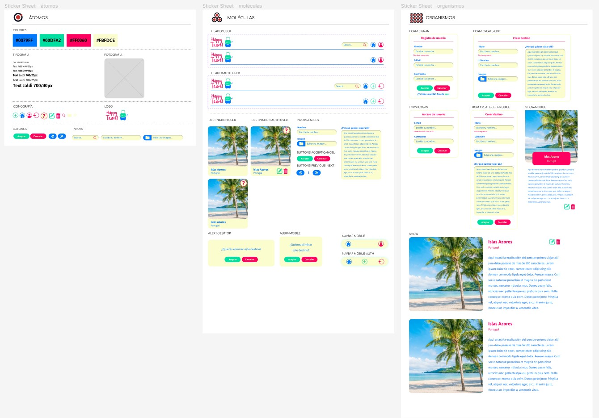
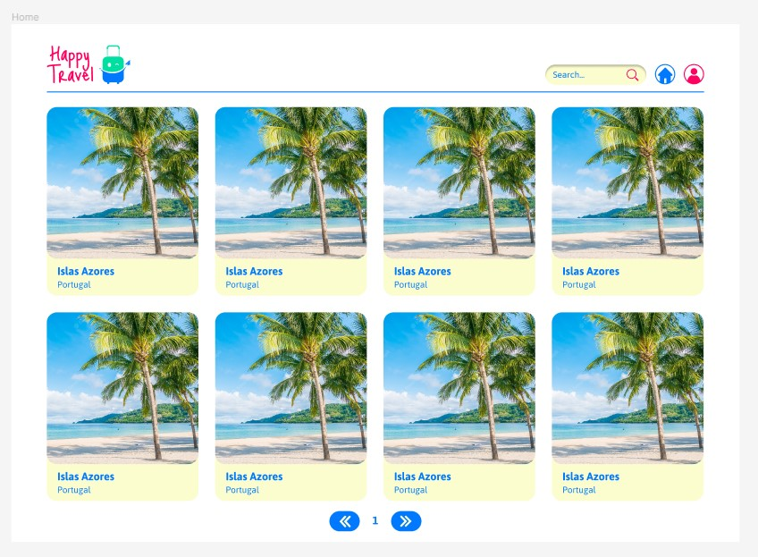
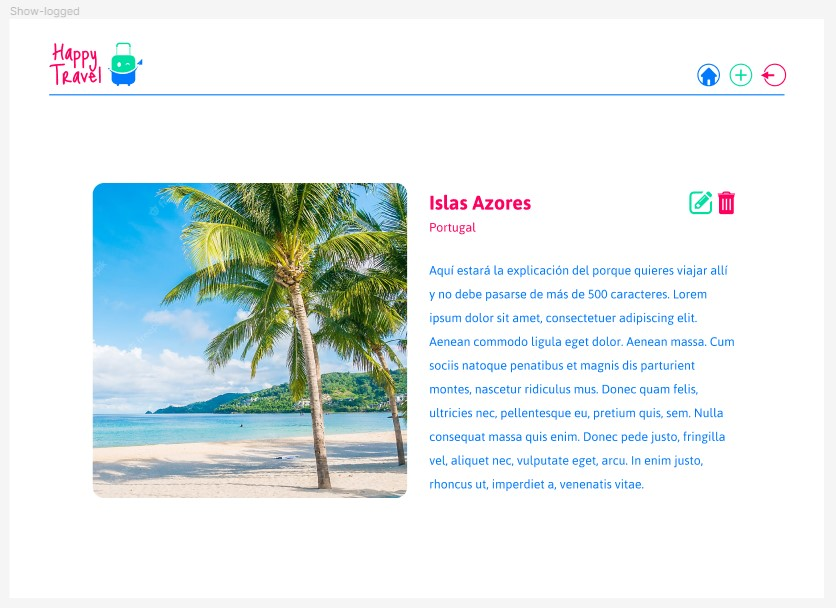

#  Happy Travel by Hacker Cats

## 📓 Tabla de contenidos 
   1. [Información General](#información-general)
   2. [Mockups](#mockups)
   3. [Tecnologías](#tecnologías)
   4. [Herramientas](#herramientas)
   5. [Instalación](#instalación)
   6. [Nuestro equipo](#nuestro-equipo)

## 🗃 Información General
La compañía HappyTravel nos ha contratado para desarrollar una plataforma web que permita conocer y compartir destinos de ensueño y las razones por las que resultan tan atractivos. El objetivo de la página es que las personas no registrados que la visitan puedan explorar los destinos, y que las personas autenticadas, además de explorar destinos, puedan también crear, editar y eliminar sus propias entradas de destinos.

## Mockups

#### Atomic Design

## Home - desktop
   

## Destino - desktop
   

## 🛠 Tecnologías

 

 

 

 

 

## 🛠 Herramientas

 Figma 
 
 Visual Studio Code
 
 Trello
 
 GitHub
 

## Instalación

Aquí tienes una breve descripción de cómo poder ver nuestro proyecto.
Para ejecutarlo necesitas tener conocimientos previos sobre como funciona Mamp/Xamp y tener instalado composer.

Sigue estos pasos para acceder al proyecto:
1. Clona este repositorio en tu máquina local: https://github.com/AliciaoE/HappyTravel-Front.git
2. Coloca la carpeta del proyecto en la carpeta de proyectos de tu MAMP o XAMPP según sea el caso.
3. Crea la base de datos y la tabla:
- Abre tu gestor de bases de datos (por ejemplo, phpMyAdmin).
- Crea una nueva base de datos con el nombre  "happy_travel". Las tablas las realizaremos desde tu editor de código.
4. Abre en tu editor de texto el proyecto, abre su terminal y dentro de la carpeta laravel debes poner
`composer install`
después, para cargar las tablas del proyecto, escribe el comando
`php artisan migrate`
Ya que se trata de una aplicación para guardar y compartir destinos, hemos creado los seeders para tener de antemano algunos datos en la base de datos. Estos seeders te permitirán tener 10 destinos ya publicados. No podrás borrarlos, ni editarlos a diferencia de los que cargues tú. Para poder tener estos 10 destinos creados a través de seeders, escribe en la terminal
`php artisan db:seed --class=DestinationsTableSeeder`

y finalmente para ver el proyecto en tu navegador ejecuta el comando 

`php artisan server`

Y disfruta de la experiencia de ver y guardar destinos.

Si quieres acceder al reposorio del backend del proyecto, sigue este enlace: https://github.com/AliciaoE/HappyTravel-Back

## Equipo Hacker Cats

Somos un grupo de desarrolladoras unidas por la ilusión de aprender más sobre código. Encuéntranos en:

Alicia: 
- https://github.com/AliciaoE
- https://www.linkedin.com/in/alicia-ontiveros-escudero/

Carolina:
- https://github.com/conuvedevegana
- https://www.linkedin.com/in/carolina-delfa-silvestre/

Gabriela:
- https://github.com/GabriiCoder
- https://www.linkedin.com/in/gabriela-irimia/

Gabriela:
- https://github.com/annaLucian
- https://www.linkedin.com/in/gabriela-poves-navarro/

Laura:
- https://github.com/ImLauraGS
- https://www.linkedin.com/in/laura-gil-solano/

Zohra:
- https://github.com/zohra-b
- https://www.linkedin.com/in/z-bellamine/

